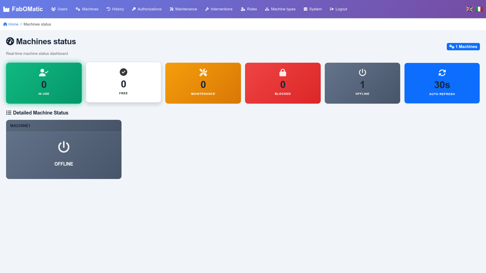

# Fab-O-Matic back-end

[](https://github.com/fablab-bergamo/rfid-backend/actions/workflows/build.yml)

## What is this project?

* This is a web application to handle a FabLab machines access by Fab-O-Matic boards connected to the machines (see ESP32 project : [Fab-O-Matic](https://github.com/fablab-bergamo/Fab-O-matic) )

* Homescreen example, with real-time machine status:



* **User Manual**: [PDF version](doc/UI.pdf) | [Markdown version](doc/UI.md)

* This Python 3.10 application runs a MQTT client and a Flask HTTPS application.

* Articles describing the project are available on FabLab Bergamo website : <https://www.fablabbergamo.it/2024/07/14/fabomatic7/>

## Features

* Web admin portal with user authentication over https

* Holds the member cards RFID database with their status (active, inactive). Easy registration of new members (swipe card on existing Fab-O-Matic and convert to new user).

* Machine maintenance plans based on actual hours with display on Fab-O-Matic LCD

* Permissions by user and machine (can be disabled)

* Machine history (usage and maintenance)

* Real-time dashboard of machines status

## Backend runtime requirements

* An external MQTT Broker. Mosquitto has been used for testing.

* SQLAlchemy supports several database engines, but this has been tested with SQLite only.

## Pre-requisites for Raspberry Pi Zero

* Install prerequisites (python 3.10+, rustc for cryptography, mosquitto, pip). It takes 3-4 hours on Raspberry Pi Zero to complete installation.

```shell
wget -qO - https://raw.githubusercontent.com/tvdsluijs/sh-python-installer/main/python.sh | sudo bash -s 3.10.9
sudo apt remove python3-apt
sudo apt install python3-apt
sudo curl --proto '=https' --tlsv1.2 -sSf https://sh.rustup.rs | sh
sudo apt install mosquitto
```

## Pre-requisites for Linux machines

* On other Linux systems, the following requisites shall be enough:

```shell
sudo apt install python3-apt
sudo apt install rustc
sudo apt install mosquitto
sudo apt install dbus-user-session
```

## Pre-requisites for firmware updates

* Espressif's ESPOTA tool is used to apply Over-the-air firmware updates to Fab-O-Matic boards.

```shell
wget https://raw.githubusercontent.com/espressif/arduino-esp32/master/tools/espota.py
```

## Installation instructions

* Install from test pypi repository

```shell
pip install FabOMatic
```

* In the package installation directory, copy src/FabOMatic/conf/settings.example.toml into settings.toml and edit settings.
  On first run, if the settings.toml file is missing, the settings.example.toml file will be copied and used instead.

* Test it with

```shell
python -m FabOMatic 5
```

* After installation login with default admin email in settings file and "admin" password.

> Default URL is https://HOSTNAME:23336/

* Setup backup strategy for database (database.sqldb), which is automatically created on first run.

* Setup systemd to automatically launch Python module on boot with user profile:

See sample configuration example in doc/systemd

## How to upgrade release

* Use pip --upgrade :

```shell
pip install FabOMatic --upgrade
```

* Review settings.toml file after installation.

* Database upgrades are applied by Alembic at start of the backend and shall not need user interaction.

## Configuration file

* For configuration, the file src/FabOMatic/conf/settings.toml in package installation directory is used.
* It contains configuration info for MQTT server (mandatory), database connection string (mandatory), SMTP for "forgot password" email (not mandatory), and weekly summary settings (optional)
* Example below

```text
[database]
url = "sqlite:///machines.sqldb"
name = "fablab"

[MQTT]
broker = "127.0.0.1"
port = 1883
client_id = "backend"
topic = "machine/"        # root topic. Subtopics will be /machine/<ID> will be subscribed
reply_subtopic = "/reply"  # appended to the machine topics for replies by backend. E.g. machine/1/reply
stats_topic = "stats/"

[web]
secret_key = "some_long_hex_string_1234gs"  # Used for encryption
default_admin_email = "admin@fablag.org"    # Used for initial login
base_url = "fabpi.example.com"              # Base URL for web application (used in emails)

[email]
server = "smtp.google.com"
port = 587
use_tls = true
username = ""
password = ""
sender = "admin@fablab.org"

[weekly_summary]
enabled = true    # Enable weekly summary emails
language = "en"   # Language for emails: "en" or "it"

```

## Developper notes

* Developped with VSCode, extensions: Python, SQLTools, SQLTools SQLite, Black formatter

* Create a python venv with Python >=3.10 and make sure your terminal has activated the venv

* Test settings are into tests\test_settings.toml file, to run tests from root folder (or Terminal)

```shell
pytest -v
```

* How to run the server from Terminal (from root folder)

```shell
pip install -e . 
python ./run.py
```

* Package requirements / How to package (see [Python docs](https://packaging.python.org/en/latest/tutorials/packaging-projects/))

```shell
pip install --upgrade build
pip install --upgrade twine
```

To update distribution

```shell
python -m build
python -m twine upload dist/*
```

* To handle schema changes with existing installations, changes the database/models.py, check that the changes are properly captured by alembic, then generate a migration script, and apply it. Then commit all files and publish a new revision.

```shell
alembic check
alembic revision --autogenerate -m "Description of change"
alembic upgrade head
```

* To handle data migration you have to manually edit the generated migration file in alembic folder.

* After testing the new database schema, archive a copy of simple-db.sqldb (generated by pytest) into tests/databases folder with the revision name. This will ensure migrations will be tested on this new release in the future.

* Translations with Babel

Initial extract (run from src/FabOMatic folder)

```shell
pybabel extract -F babel.cfg -o messages.pot ./
```

Update merging the changes the translations files

```shell
pybabel update -i messages.pot -d translations
```

Adding a new locale

```shell
pybabel init -i messages.pot -d translations -l <locale>
```

Compile the changes

```shell
pybabel compile -d translations
```

## GDPR compliance ⚖️

Members' RFID card will be tied to a physical person and therefore, you *must* collect written consent of this person as part of membership agreement.

### Suggested GDPR agreement

* The reason for data collection is *to control FabLab equipment usage for better maintenance of equipment and physical safety of the FabLab users*.
* The data conservation period for RFID master data is for the duration of the membership to the FabLab with a minimum of *one year*.
* The data conservation period of historical records, including user name, time of use, machine used, maintenance operation performed is *one year*.
* After 1 year, the historical nominative data is automatically replaced with an anonymous user data.
* The system may collect RFID tags ID from nearby cards, not tied to the FabLab RFID master data. Such information will be deleted after *one month*.
* The responsible persons for data treatment are the Fab-O-Matic administrative users.
* The collected information is not shared outside Fab-O-Matic system or disclosed outside Fab-O-Matic admins.

### What you need to do

* You *need* to secure access to the Fab-O-Matic backend webserver and physical hosts (use a proper password policy).
* You *need* to schedule a daily cron job in order to ensure data is deleted from database and logfiles

```shell
python -m FabOMatic --purge
journalctl --vacuum-time=1y
```

* To garantee data access requests, you can use the Excel export feature filtering data by the user.
* To garantee right to deletion, you can use the Delete buttons on Use, Interventions and User pages.

## Weekly Summary Emails 📧

Fab-O-Matic can send automated weekly summary emails to users with statistics about machine usage, pending maintenance, and unrecognized cards.

### Configuration

Add the following settings to your `settings.toml`:

```toml
[web]
base_url = "your.external.url.for.fabomatic"  # Your FabOMatic URL (used in email links)

[weekly_summary]
enabled = true       # Enable/disable weekly summary emails
language = "en"      # Language for emails: "en" or "it"
```

### User Configuration

* Users must have an email address configured in their profile
* Users must enable "Receive weekly summary emails" checkbox in their profile
* This can be configured when adding or editing users in the admin interface

### Scheduling Weekly Summaries

Set up a cron job to send weekly summaries. For example, to send every Sunday at 9 AM:

```shell
# Edit crontab
crontab -e

# Add this line to send weekly summaries every Sunday at 9:00 AM
0 9 * * 0 cd /path/to/FabOMatic && /path/to/venv/bin/python -m FabOMatic --weekly-summary --loglevel 40
```

### Email Contents

Weekly summary emails include:
* **Machine Usage Statistics**: Time spent on each machine during the week (Sunday to Sunday)
* **Pending Maintenance**: List of machines requiring maintenance with hours overdue
* **Unrecognized Cards**: RFID cards that attempted access but are not registered
* **Direct link**: Link to FabOMatic web interface for more details

### Testing

To manually trigger a weekly summary email:

```shell
python -m FabOMatic --weekly-summary
```

## Main revision log

| Version | When | Release notes |
|--|--|--|
| 0.0.18 | January 2024 | first revision with Alembic for database version tracking to handle graceful updates |
| 0.1.15 | February 2024 | improved UI on mobile, fixed duplicated uses, added grace period definition on machine types, added system page |
| 0.2.0 | February 2024 | UI translations with flask-babel (IT, EN), added boards details in system page |
| 0.3.0 | May 2024 | User authorizations can be disabled by Machine type, Maintenance URL field added, System page improvements (DB reload, log files)  |
| 0.4.0 | June 2024 | Buffered messages sent by Fab-O-Matic boards are flagged with a clock icon. |
| 0.5.0 | June 2024 | First release on PyPi. Renamed to FabOMatic. Added GDPR compliance (purge function) |
| 0.6.0 | August 2024 | Added remote commands from backend for cloud-enabled printers like BambuLab |
| 0.7.0 | December 2024 | Bugfix release, no new features |
| 0.7.4 | October 2024 | Added new settings page in Systems, fixed email hanging issue |
| 1.0.0 | October 2025 | **Major release**: Complete UI modernization with modern design, search/filter functionality, improved navigation, responsive design, and enhanced user experience |
| 1.0.1 | October 2025 | Added weekly summary email feature with automated activity reports, pending maintenance alerts, and unrecognized cards tracking. Fixed HTML link rendering bug in emails. |
