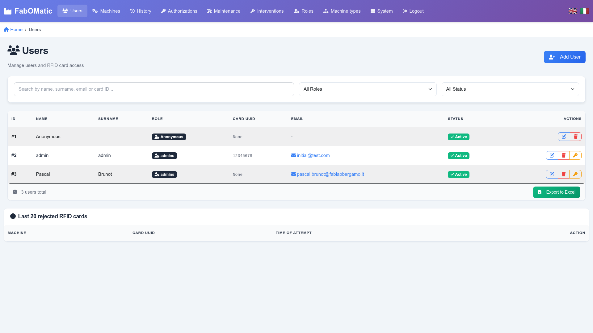
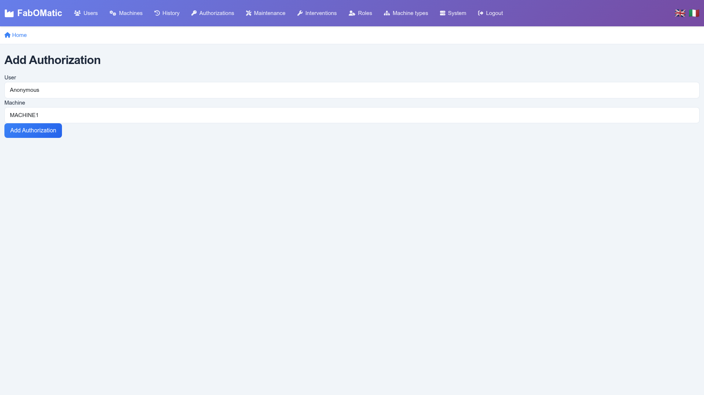
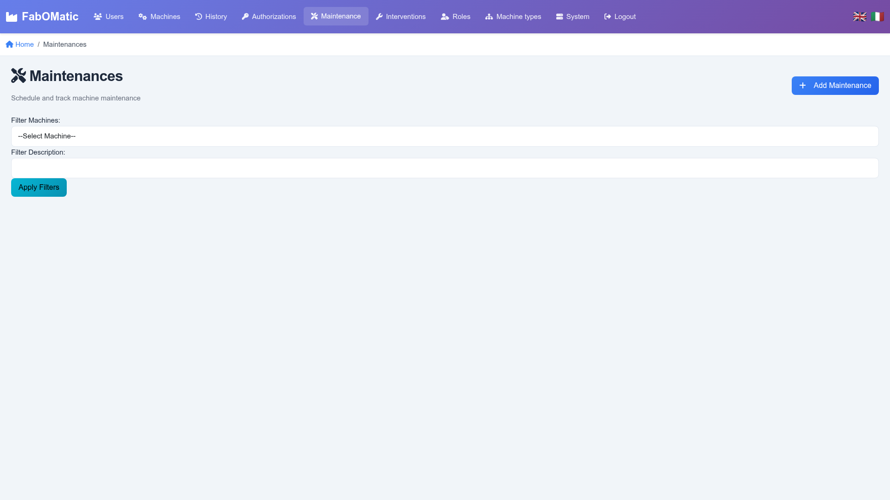
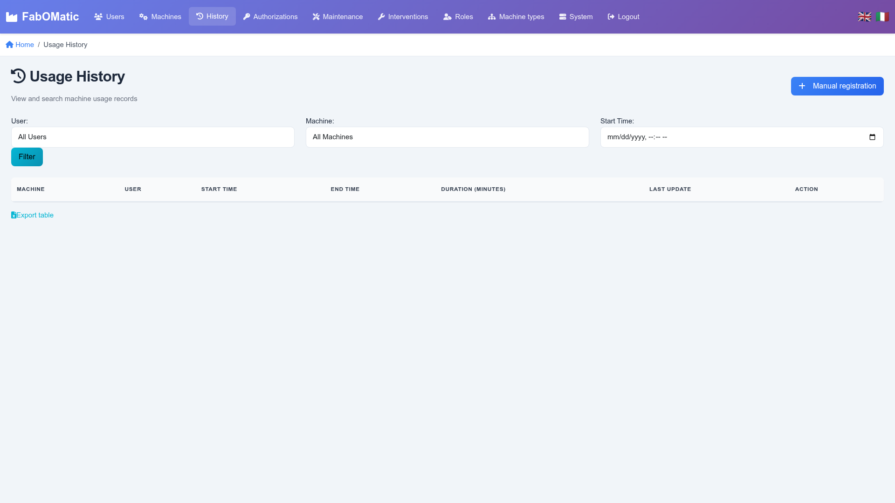
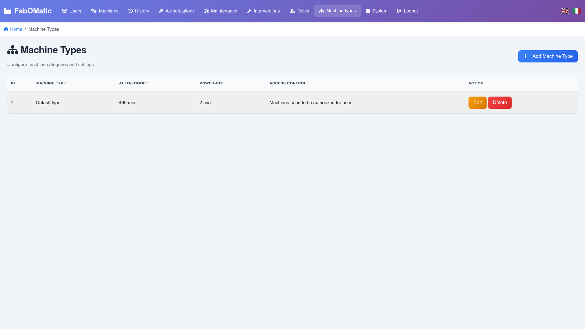

# Fabomatic-backend -- versione 1.0.1

**[English](UI.md)** | **Italiano**

## Contenuti

- [Novità della 1.0.1](#novità-della-101)
- [Novità della 1.0.0](#novità-della-100)
- [Autenticazione](#autenticazione)
- [Menu](#menu)
- [Schermata principale](#schermata-principale)
- [Ruoli](#ruoli)
- [Utenti](#utenti)
- [Macchine](#macchine)
- [Autorizzazioni](#autorizzazioni)
- [Manutenzione](#manutenzione)
- [Interventi](#interventi)
- [Cronologia utilizzo](#cronologia-utilizzo)
- [Tipi di macchina](#tipi-di-macchina)
- [Pagina di sistema](#pagina-di-sistema)
- [Editor di configurazione](#editor-di-configurazione)
- [Esportazione Excel](#esportazione-excel)
- [Dettagli tecnici](#dettagli-tecnici)

## Novità della 1.0.1

La versione 1.0.1 aggiunge email di riepilogo settimanale automatiche e corregge un bug critico nel rendering delle email.

### Nuove Funzionalità

#### Email di Riepilogo Settimanale 📧

FabOMatic ora può inviare riepiloghi settimanali automatici delle attività agli utenti che aderiscono:

- **Statistiche di Utilizzo delle Macchine**: Mostra il tempo trascorso su ogni macchina durante la settimana passata (da domenica a domenica)
- **Avvisi di Manutenzione in Sospeso**: Elenca le macchine che richiedono manutenzione con ore di ritardo
- **Report Tessere Non Riconosciute**: Mostra le tessere RFID che hanno tentato l'accesso ma non erano registrate
- **Template Email Professionali**: Versioni HTML e testo semplice con design moderno e responsive
- **Internazionalizzazione**: Supporta lingue inglese e italiana
- **Consenso Utente**: Gli utenti possono abilitare/disabilitare i riepiloghi settimanali nelle impostazioni del profilo
- **Configurazione di Sistema**: Gli amministratori possono abilitare/disabilitare la funzionalità e impostare la lingua globalmente

**Requisiti di Configurazione:**
- Configurare il server email in `settings.toml` (impostazioni SMTP)
- Configurare `base_url` nelle impostazioni web per i link nelle email
- Abilitare i riepiloghi settimanali nella sezione `[weekly_summary]`
- Pianificare tramite cron job (es., `python -m FabOMatic --weekly-summary`)

### Correzioni di Bug

- **Corretto il rendering dei link HTML nelle email**: In precedenza, i link HTML nei piè di pagina delle email venivano visualizzati come testo escaped (es., `Visit <a href="...">FabOMatic</a>`) invece di link cliccabili. Questo influenzava tutte le comunicazioni email ed è stato corretto.

### Aggiornamenti dell'Interfaccia Utente

- Aggiunta casella di controllo "Ricevi email di riepilogo settimanale" nei moduli di aggiunta/modifica utente
- Gli utenti devono avere un indirizzo email configurato per ricevere i riepiloghi settimanali

## Novità della 1.0.0

La versione 1.0.0 rappresenta una pietra miliare importante per FabOMatic con una completa modernizzazione dell'interfaccia utente e diversi miglioramenti significativi.

## Interfaccia Utente Moderna

L'intera interfaccia web è stata ridisegnata con un aspetto moderno e professionale:

### Design Visivo
- **Nuovo Schema di Colori**: Navbar con gradiente viola moderno che rispecchia il branding FabLab
- **Framework CSS Personalizzato**: 859 righe di styling professionale con sistema di design coerente
- **Icone FontAwesome**: Icone in tutta l'interfaccia per un migliore riconoscimento visivo
- **Animazioni Fluide**: Transizioni e animazioni per un'esperienza utente raffinata
- **Schede con Gradiente**: Schede di stato macchina con gradienti di colore e animazioni pulsanti per macchine attive

### Miglioramenti della Navigazione
- **Navbar Migliorata**: Sfondo con gradiente con contrasto e visibilità migliorati
- **Navigazione con Icone**: Ogni voce di menu ora ha un'icona pertinente per una rapida identificazione
- **Evidenziazione Pagina Attiva**: La pagina corrente è evidenziata nel menu di navigazione
- **Navigazione Breadcrumb**: Tutte le pagine ora includono breadcrumb che mostrano la posizione corrente
- **Indicatore Stato MQTT**: Visibilità migliorata dello stato della connessione nella navbar

### Miglioramento delle Tabelle Dati
- **Funzionalità di Ricerca**: Ricerca in tempo reale su tutte le tabelle dati (Utenti, Macchine, ecc.)
- **Filtri Avanzati**: Filtra per ruolo, stato, tipo di macchina e altri criteri
- **Design Tabella Moderno**: Spaziatura migliorata, effetti hover e gerarchia visiva
- **Migliore Esperienza Mobile**: Le tabelle si adattano a schermi più piccoli con colonne responsive

### Dashboard Macchine
- **Statistiche Riepilogative**: Schede di panoramica rapida che mostrano conteggi delle macchine per stato
- **Indicatori di Stato Visivi**: Schede codificate per colore con icone (In Uso: verde, Libera: bianco, Manutenzione: arancione, Bloccata: rosso, Offline: grigio)
- **Indicatore di Aggiornamento Automatico**: Timer di aggiornamento di 30 secondi visibile
- **Macchine Attive Animate**: Animazione pulsante sulle macchine attualmente in uso

### Design Responsive
- **Approccio Mobile-First**: Interfaccia ottimizzata per dispositivi touch
- **Layout Adattivi**: Il contenuto si riorganizza per una visualizzazione ottimale su tutte le dimensioni dello schermo
- **Ottimizzato per Touch**: Target touch più grandi per utenti mobile
- **Breakpoint**: Design responsive a 768px e 992px per tablet e desktop

### Miglioramenti dell'Esperienza Utente
- **Migliore Gerarchia Visiva**: Chiara distinzione tra intestazioni, contenuto e azioni
- **Leggibilità Migliorata**: Font family Inter per una maggiore leggibilità
- **Spaziatura Coerente**: Margini e padding uniformi ovunque
- **Form Migliorati**: Campi di input moderni con stati di focus e validazione
- **Pulsanti Professionali**: Sfondi con gradiente con effetti hover e transizioni fluide

## Miglioramenti del Sistema Email (dalla 0.7.4)

- **Protezione Timeout**: Aggiunti timeout per prevenire il blocco indefinito delle operazioni email
- **Invio Email Asincrono**: Operazioni email non bloccanti per migliori prestazioni
- **Logging Completo**: Logging dettagliato per operazioni di reset password per aiutare la risoluzione dei problemi

## Correzioni di Bug

- **Correzione Conteggio Macchine**: Corretta la logica di riepilogo della dashboard che mostrava conteggi negativi per macchine libere. Il conteggio ora usa logica if-elif prioritaria coerente assicurando che ogni macchina sia contata esattamente una volta.

# Autenticazione

La pagina predefinita è una pagina di login e tutte le altre pagine del sito richiedono un utente autenticato.

Solo gli utenti con indirizzo email e flag ruolo « Can Admin backend » possono effettuare il login.

## Primo Login

Dopo l'installazione, viene creato automaticamente un account amministratore predefinito utilizzando l'indirizzo email specificato nel file di configurazione (`settings.toml` → `web.default_admin_email`).

**Credenziali predefinite:**

-   **Email**: `admin@fablab.org` (o l'email configurata in settings.toml)
-   **Password**: `admin`

**Importante**: Cambiare la password predefinita immediatamente dopo il primo login per motivi di sicurezza.

## Reset Password

Nel caso un amministratore dimentichi la password, cliccare su "Forgot password?" per ricevere un'email con un link di reset unico valido per 20 minuti.

# Menu

Questa è la vista per gli utenti autenticati:

Cliccando su FABLAB si raggiunge la schermata principale.

# Schermata principale

La schermata principale presenta una vista in tempo reale delle varie macchine.

Descrizione degli stati:

-   IN USE = c'è un record di utilizzo aperto (manuale o automatico) su questa macchina

-   BLOCKED = la macchina è stata contrassegnata come « BLOCKED FOR ALL »

-   OFFLINE = l'RFID non ha contattato il backend per più di 3 minuti

-   MAINTENANCE = la macchina è libera ma richiede un intervento di manutenzione in base al piano

-   FREE = la macchina è inattiva e in attesa di utenti

# Ruoli

Questo serve per configurare i livelli di privilegio degli utenti.

## Visualizzazione

Maintenance = L'utente può eseguire manutenzione toccando la tessera sulla scheda macchina

Authorize all = L'utente può usare qualsiasi macchina in qualsiasi stato. Questo bypassa anche l'autorizzazione. Questo può essere utile in una fase iniziale dove tutti gli utenti del fablab possono usare qualsiasi macchina in qualsiasi stato.

Backend admin = L'utente può effettuare il login all'interfaccia web backend con il suo indirizzo email. Al primo accesso, deve prima ricevere una nuova password da un amministratore con la pagina Utenti.

Reserved = Ruoli che non possono essere eliminati.

Il ruolo Anonymous è usato per utenti anonimizzati per limitare la conservazione dei dati personali nel sistema.

## Aggiungi nuovo ruolo

Aggiungere un nuovo ruolo può essere utile per gestire permessi più granulari.

Vedere la pagina Ruoli per la descrizione dei flag.

## Modifica ruolo esistente

# Utenti

Gli utenti sono identificati dal loro ID tessera RFID. Non c'è autenticazione forte delle tessere RFID nella scheda Arduino, solo lettura dell'ID del chip. Questa è una limitazione della scheda MFRC522 usata dal PCB Fab-O-Matic.

## Visualizzazione

Questa pagina mostra gli utenti e i tag RFID non riconosciuti, e permette diverse azioni:

-   Aggiungere nuovi utenti, modificarli/disabilitarli. Un utente disabilitato non può eseguire alcuna azione sulle macchine, ma può ancora effettuare il login all'interfaccia

-   Eliminare utenti. In questo caso l'utente non può effettuare il login al webbackend.

-   Convertire un badge in un nuovo utente: questo serve principalmente a semplificare la creazione iniziale del database quando gli utenti del fablab potrebbero non essere registrati. Una volta creato l'utente, i corrispondenti record di tessere RFID rifiutate verranno eliminati.

## Modifica utente esistente

Questo permette di cambiare ruolo utente, nome, email o UUID tessera.

Puoi anche configurare le preferenze email:
- **Indirizzo email**: Richiesto per il reset password e le email di riepilogo settimanale
- **Ricevi email di riepilogo settimanale**: Seleziona questa casella per abilitare riepiloghi automatici delle attività settimanali (richiede indirizzo email)

## Aggiungi nuovo utente

Questa pagina si raggiunge con il pulsante « Add User » o il pulsante « Convert to new user » sulla pagina principale.

Nota bene:

-   L'UUID della [Card]{.underline} viene visualizzato sul display LCD dell'arduino quando si tocca una tessera sconosciuta.

-   Quando si converte una tessera sconosciuta, il campo Card UUID viene compilato automaticamente

# Macchine

Questa è la lista delle macchine. Ogni macchina ha un ID unico. La scheda Arduino è collegata univocamente a una macchina grazie al campo ID.

## Visualizza macchine

Descrizione:

-   Cumulated usage: ore di accensione da parte degli utenti. Questo non viene azzerato.

-   Maintenance plan: lista delle procedure di manutenzione da applicare alla macchina

-   Last seen: quando una scheda arduino ha trasmesso per l'ultima volta lo stato della macchina.

Pulsante View History: visualizza gli ultimi utilizzi della macchina

## Modifica macchina

Permette di cambiare gli attributi della macchina. Il nome della macchina viene acquisito dalla scheda arduino ogni minuto in caso di modifiche.

Blocked for all: questo blocca qualsiasi utente dal fare login sulla macchina eccetto gli utenti con privilegio di ruolo « authorize all ».

## Aggiungi macchina

Uguale alla schermata di Modifica.

# Autorizzazioni

Le autorizzazioni mappano gli utenti alle macchine. Se un utente appartiene a un ruolo con «Authorize all », la lista delle autorizzazioni viene ignorata. Questo può essere utile se il FabLab non vuole implementare autorizzazioni per gli utenti fab.

## Visualizza autorizzazioni

La lista delle autorizzazioni per macchina e utenti può essere filtrata.

Descrizione:

-   Add Authorization: per aggiungere un record per un singolo utente su una singola macchina

-   Add in bulk: per aggiungere rapidamente autorizzazioni per molti utenti su una singola macchina

## Aggiungi autorizzazione

## Modifica autorizzazione

Aggiungi in blocco

Usa questa schermata per aggiungere permessi. Per rimuovere permessi, devi usare il pulsante Delete della schermata principale.

Prima seleziona la macchina, poi gli utenti o il pulsante « Add all users.. ».

# Manutenzione

Questo è per la manutenzione regolare che deve essere attivata ogni X ore di utilizzo.

## Visualizzazione

Lista filtrabile delle azioni di manutenzione.

## Modifica

Description: una descrizione di cosa deve essere fatto

LCD Message: cosa deve essere visualizzato sul pannello LCD quando la manutenzione viene attivata

Number of hours to trigger: quante ore di lavoro devono essere trascorse

Instructions: facoltativo, URL alle istruzioni come dal produttore.

Machine: quale macchina necessita di questa azione di manutenzione

## Aggiungi nuova manutenzione

Description: una descrizione di cosa deve essere fatto

LCD Message: cosa deve essere visualizzato sul pannello LCD quando la manutenzione viene attivata

Number of hours to trigger: quante ore di lavoro devono essere trascorse

Instructions: facoltativo, URL alle istruzioni come dal produttore.

Machine: quale macchina necessita di questa azione di manutenzione

# Interventi

## Visualizzazione

## Aggiungi manualmente

Gli interventi verranno creati automaticamente toccando la tessera sulla scheda macchina, ma possono essere aggiunti manualmente se la manutenzione è stata fatta offline.

## Modifica interventi

# Cronologia utilizzo

## Visualizzazione

Questa pagina mostra gli ultimi utilizzi di tutte le macchine (fino a 500 record).

Se una macchina è in uso, la riga è evidenziata:

Registrazione manuale

Questo permette di registrare un utilizzo specifico di una macchina da parte di un utente, ad es. per il tracciamento delle ore macchina.

# Tipi di macchina

## Visualizzazione

Descrizione:

-   Auto logoff delay: se un utente rimane attivo più di X minuti sulla macchina, la scheda arduino lo disconnetterà. Quando impostato a 0, non c'è disconnessione automatica.

-   Power-off: quando nessun utente è connesso, la macchina verrà spenta dopo questo periodo di grazia. Se 0, il relè di comando viene chiuso immediatamente alla disconnessione. L'obiettivo di questa funzionalità è ridurre i cicli di accensione sull'attrezzatura target.

## Pagina Aggiungi/Modifica

# Pagina di sistema

Questa pagina fornisce una panoramica del server backend host, helper di manutenzione, e elenca le schede che si sono annunciate sul broker MQTT.

Database:

-   Questo permette di scaricare il database SQLite3 per i backup.

Informazioni di sistema

-   Visualizza la natura del sistema (in questo esempio, un Raspberry Pi Zero)

Informazioni applicazione

-   Controlla l'ultima versione sul repository pypi (richiede accesso internet)

-   Il pulsante Update application esegue pip --upgrade

-   Il pulsante Restart application esegue systemctl restart

Lista schede:

-   ID: ID unico impostato dal sistema, senza significato

-   Machine ID: la scheda annuncia il MachineID che vuole gestire.

-   IP Address: IP della scheda connessa alla macchina. Utile per aggiornamenti OTA

-   FW version: versione git del firmware annunciata dalla scheda

-   Last seen: quando la scheda si è annunciata per l'ultima volta. Gli annunci sono indipendenti dagli altri messaggi delle schede.

# Editor di configurazione

*Novità nella versione 0.7.3*

L'editor di configurazione permette agli amministratori di modificare le impostazioni di sistema di FabOMatic direttamente tramite l'interfaccia web, eliminando la necessità di accesso SSH o modifica manuale dei file.

## Accesso all'Editor di Configurazione

Dalla pagina Sistema, cliccare il pulsante **"Edit Configuration"** nella sezione Application info.

## Posizioni dei File di Configurazione

FabOMatic cerca i file di configurazione nel seguente ordine di priorità:

1.  **~/.config/FabOMatic/settings.toml** (Raccomandato - specifico utente, sopravvive agli aggiornamenti pip)
2.  **/etc/FabOMatic/settings.toml** (A livello di sistema, richiede accesso root)
3.  **~/FabOMatic/settings.toml** (Posizione utente alternativa)
4.  **Directory del pacchetto** (Solo per retrocompatibilità)

Il percorso del file di configurazione attivo viene visualizzato in cima all'editor. Al salvataggio, le impostazioni vengono scritte nella prima posizione scrivibile (tipicamente `~/.config/FabOMatic/settings.toml`).

## Sezioni di Configurazione

### Impostazioni Database

-   **Database URL**: Stringa di connessione per il database SQLite
    -   Esempio: `sqlite:///database.sqldb`
    -   Può essere un percorso assoluto o relativo
-   **Database Name**: Nome logico per il database

### Impostazioni MQTT

-   **MQTT Broker**: Hostname o indirizzo IP del broker MQTT (es., `localhost`, `192.168.1.100`)
-   **MQTT Port**: Numero di porta per la connessione MQTT (predefinito: `1883`)
-   **Client ID**: Identificatore unico per questa istanza backend FabOMatic
-   **Machine Topic**: Topic base per comunicazioni macchine (es., `machine`)
-   **Reply Subtopic**: Subtopic per risposte backend alle schede (es., `reply`)
-   **Stats Topic**: Topic per pubblicare statistiche di sistema (es., `stats/`)
-   **MQTT User**: Username per autenticazione MQTT (opzionale, lasciare vuoto se non usato)

### Impostazioni Applicazione Web

-   **Secret Key**: Chiave di crittografia sessione Flask
    -   **Importante**: Cambiare questo a una stringa casuale per la produzione
    -   Usato per proteggere sessioni utente e cookie
-   **Default Admin Email**: Indirizzo email per l'account admin predefinito
    -   Usato per il login iniziale e il seeding del database

### Impostazioni Email

-   **SMTP Server**: Hostname del server mail (es., `smtp.gmail.com`)
-   **SMTP Port**: Porta del server mail (tipicamente `587` per TLS o `465` per SSL)
-   **Use TLS**: Abilita crittografia TLS per trasmissione email (checkbox)
-   **Username**: Username autenticazione SMTP
-   **Password**: Password autenticazione SMTP
    -   Lasciare vuoto per mantenere la password corrente invariata
    -   Le password sono memorizzate nel file di configurazione

## Salvare le Modifiche

1.  Modificare le impostazioni desiderate nel modulo
2.  Cliccare **"Save Configuration"** per scrivere le modifiche su disco
3.  Il sistema:
    -   Validerà tutti i campi richiesti e i tipi di dati
    -   Creerà un backup automatico della configurazione precedente (con estensione `.bak`)
    -   Salverà le nuove impostazioni nella posizione accessibile all'utente
4.  **Riavviare l'applicazione** perché le modifiche abbiano effetto usando il pulsante "Restart Application"

## Note Importanti

-   **Validazione**: Tutte le impostazioni vengono validate prima del salvataggio. Voci non valide verranno rifiutate con un messaggio di errore.
-   **Backup Automatici**: Ogni salvataggio crea un backup timestamped della configurazione precedente.
-   **Sicurezza Aggiornamento**: Configurazioni memorizzate in `~/.config/FabOMatic/` persistono attraverso operazioni `pip install --upgrade`.
-   **Sicurezza Password**: Le password email sono memorizzate in testo semplice nel file di configurazione. Assicurarsi che i permessi del file siano impostati correttamente.
-   **Riavvio Applicazione Richiesto**: Le modifiche hanno effetto solo dopo aver riavviato l'applicazione FabOMatic.

# Esportazione Excel

Sulla maggior parte delle pagine, è disponibile un pulsante di esportazione Excel, che esporta le tabelle SQLite sottostanti.

# Dettagli tecnici

-   <https://github.com/fablab-bergamo/rfid-backend>

-   Applicazione Flask python + client MQTT
