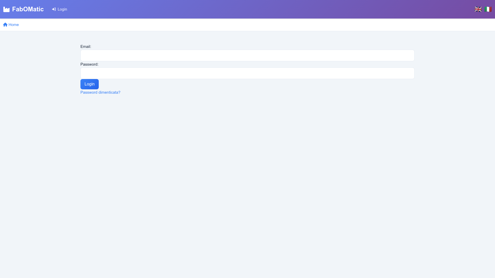
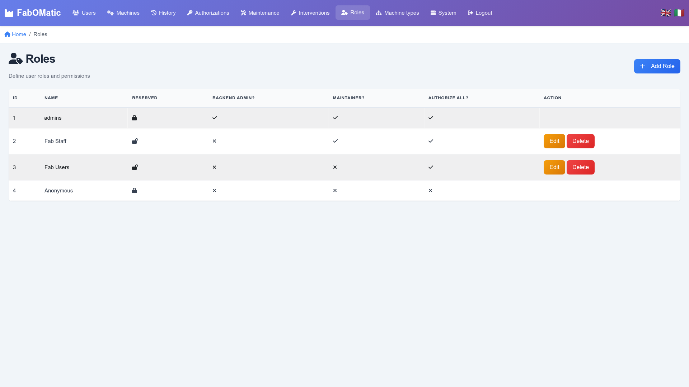
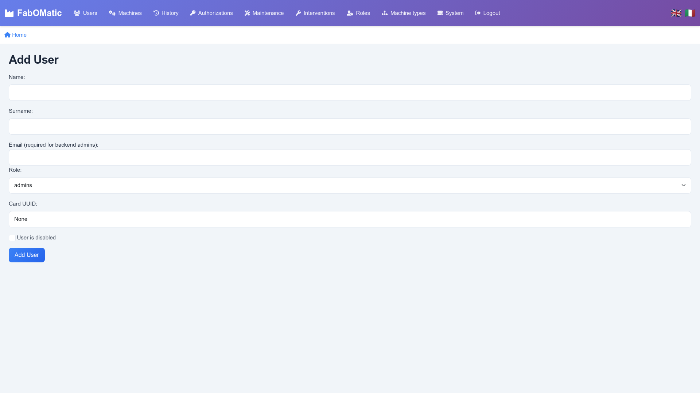
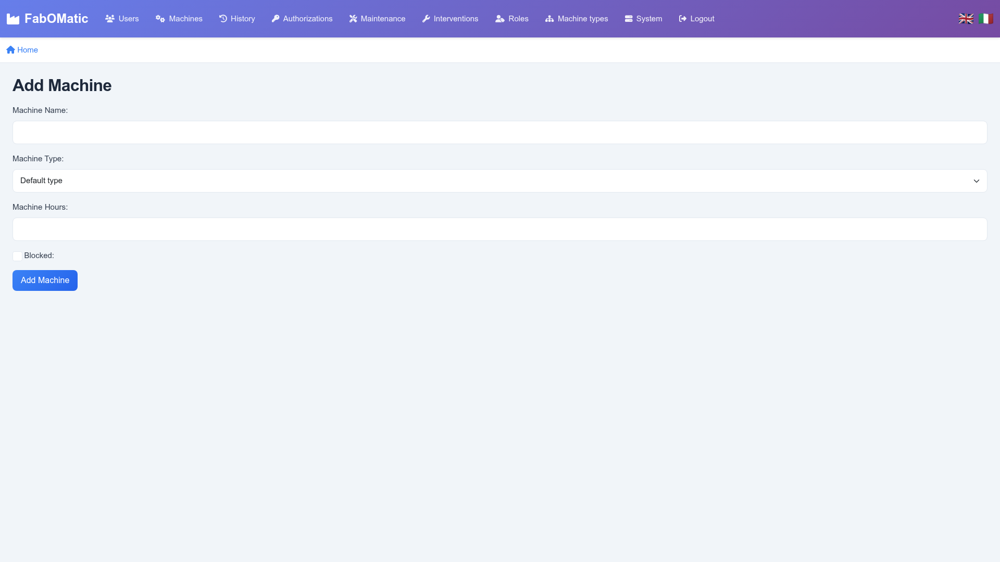
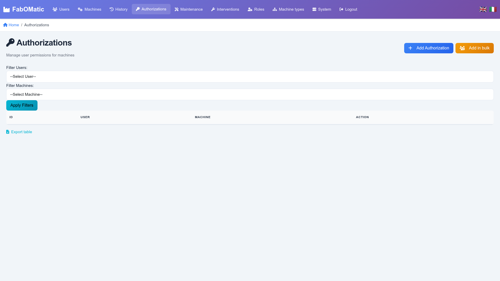
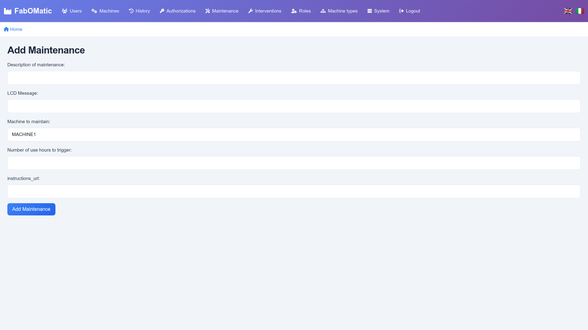
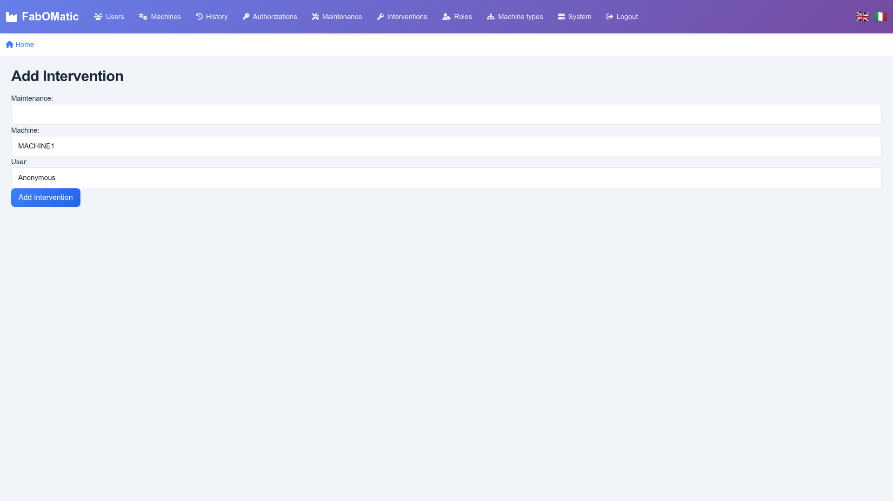

Fabomatic-backend -- release 1.0.0 {#fabomatic-backend-release-1.0.0 .TOC-Heading}
==================================

Contents {#contents .TOC-Heading}
========

[What's New in 1.0.0 2](#whats-new-in-100)

[Authentication 3](#authentication)

[Menu 4](#menu)

[Homescreen 3](#homescreen)

[Roles 4](#roles)

[Users 6](#users)

[Machines 7](#machines)

[Authorizations 9](#authorizations)

[Maintenance 11](#maintenance)

[Interventions 13](#interventions)

[Usage history 14](#usage-history)

[Machine types 15](#machine-types)

[System page 16](#system-page)

[Configuration Editor 17](#configuration-editor)

[Excel export 18](#excel-export)

[Technical details 19](#technical-details)

What's New in 1.0.0
===================

Version 1.0.0 represents a major milestone for FabOMatic with a complete user interface modernization and several important improvements.

## Modern User Interface

The entire web interface has been redesigned with a modern, professional appearance:

### Visual Design
- **New Color Scheme**: Modern purple gradient navbar matching FabLab branding
- **Custom CSS Framework**: 859 lines of professional styling with consistent design system
- **FontAwesome Icons**: Icons throughout the interface for better visual recognition
- **Smooth Animations**: Transitions and animations for a polished user experience
- **Gradient Cards**: Machine status cards with color gradients and pulse animations for active machines

### Navigation Improvements
- **Enhanced Navbar**: Gradient background with improved contrast and visibility
- **Icon Navigation**: Each menu item now has a relevant icon for quick identification
- **Active Page Highlighting**: Current page is highlighted in the navigation menu
- **Breadcrumb Navigation**: All pages now include breadcrumbs showing the current location
- **MQTT Status Indicator**: Improved visibility of connection status in the navbar

### Data Tables Enhancement
- **Search Functionality**: Real-time search across all data tables (Users, Machines, etc.)
- **Advanced Filtering**: Filter by role, status, machine type, and other criteria
- **Modern Table Design**: Improved spacing, hover effects, and visual hierarchy
- **Better Mobile Experience**: Tables adapt to smaller screens with responsive columns

### Machine Dashboard
- **Summary Statistics**: Quick overview cards showing counts of machines by status
- **Visual Status Indicators**: Color-coded cards with icons (In Use: green, Free: white, Maintenance: orange, Blocked: red, Offline: gray)
- **Auto-refresh Indicator**: Visible 30-second refresh timer
- **Animated Active Machines**: Pulse animation on machines currently in use

### Responsive Design
- **Mobile-First Approach**: Interface optimized for touch devices
- **Adaptive Layouts**: Content reorganizes for optimal viewing on all screen sizes
- **Touch-Optimized**: Larger touch targets for mobile users
- **Breakpoints**: Responsive design at 768px and 992px for tablets and desktops

### User Experience Improvements
- **Better Visual Hierarchy**: Clear distinction between headers, content, and actions
- **Improved Readability**: Inter font family for enhanced legibility
- **Consistent Spacing**: Uniform margins and padding throughout
- **Enhanced Forms**: Modern input fields with focus states and validation
- **Professional Buttons**: Gradient backgrounds with hover effects and smooth transitions

## Email System Improvements (from 0.7.4)

- **Timeout Protection**: Added timeouts to prevent email operations from hanging indefinitely
- **Async Email Sending**: Non-blocking email operations for better performance
- **Comprehensive Logging**: Detailed logging for password reset operations to aid troubleshooting

## Bug Fixes

- **Machine Count Fix**: Corrected dashboard summary logic that was showing negative counts for free machines. The counting now uses consistent if-elif priority logic ensuring each machine is counted exactly once.

Authentication
==============

The default page is a login page and all other site pages requires a logged-on user.

Only users with email address and rôle « Can Admin backend » flag can log on.

## First Login

After installation, a default administrator account is automatically created using the email address specified in the configuration file (`settings.toml` → `web.default_admin_email`).

**Default credentials:**

-   **Email**: `admin@fablab.org` (or the email configured in settings.toml)
-   **Password**: `admin`

**Important**: Change the default password immediately after first login for security reasons.

## Password Reset

In case an admin forgets the password, click "Forgot password?" to receive an email with a unique reset link valid for 20 minutes.

Menu
====

This is the view for logged users :

By clicking on FABLAB you reach the homescreen.

Homescreen
==========

The homescreen presents a real-time view of the various machines.

Status description :

-   IN USE = there is an opened use record (manual or automatic) on this machine

-   BLOCKED = the machine has been flagged « BLOCKED FOR ALL »

-   OFFLINE = the RFID has not contacted the backend for more than 3 minutes

-   MAINTENANCE = the machine is free but requires maintenance intervention based on the plan

-   FREE = the machine is idle and waiting for users

Roles
=====

This is to configure user priviledge levels.

View
----

Maintenance = The user can perform maintenance by tapping the card on machine board

Authorize all = User can use any machine in any state. This also bypasses the authorization. This can be useful in an initial phase where all fablab users can use any machine in any state.

Backend admin = User can logon to the backend web interface with its email address. On first access, he needs to receive first a new password by an admin with the Users page.

Reserved = Roles that cannot be deleted.

The Anonymous role is used for anynomized users to limit personal data retention in the system.

Add new role
------------

Adding a new role can be helpful to handle more fine-grained permissions.

See Roles page for flag description.

Edit existing role
------------------

Users
=====

Users are identified by their RFID card ID. There is no strong authentication of RFID cards in the Arduino board, only chip ID read. This is a limitation of the MFRC522 board used by the Fab-O-Matic PCB.

View
----

This page shows the users and unrecognized RFID tags, and allows several actions:

-   Adding new users, editing/disabling them. A disabled user cannot perform any action on the machines, but can still logon to the interface

-   Deleting users. In this case the user cannot logon to the webbackend.

-   Convert a badge to a new user: this is mainly to simplify the initial database creation where the fablab users may not be registered. Once the user is created, the corresponding rejected RFID card records will be purged.

Edit existing user
------------------

This allows to change user rôle, name, email or card UUID.

Add new user
------------

This page is reached by « Add User » button or « Convert to new user » button on the main page.

Please note :

-   [Card]{.underline} UUID is displayed on the arduino LCD when tapping an unknown card.

-   When converting a unknown card, the Card UUID field is automatically filled

Machines
========

This is the list of machines. Every machine has a unique ID. The Arduino Board is uniquely linked to a machine thanks to the ID field.

View machines
-------------

Description :

-   Cumulated usage : hours of power on by users. This is not reset.

-   Maintenance plan : list of maintenance procedures to be applied to the machine

-   Last seen : when an arduino board has last trasmitted the status of the machine.

View History button : view the latest uses of the machine

Edit machine
------------

Allows to change machine attributes. The machine name is acquired by the arduino board every minute in case of changes.

Blocked for all : this blocks any user to log on the machine except for user having « authorize all » rôle priviledge.

Add machine
-----------

Same as Edit Screen.

Authorizations
==============

Authorizations maps users to machines. If a user belongs to a rôle with «Authorize all », the authorizations list is ignored. This can be useful if the FabLab does not want to implement authorization for fab users.

View authorizations
-------------------

The list of authorization by machine and users can be filtered.

Description :

-   Add Authorization : to add a record for a single user on a single machine

-   Add in buil : to quickly add authorizations for many users on a single machine

Add authorization
-----------------

Edit authorization
------------------

Add in bulk

Use this screen to add permissions. To remove permissions, you have to use the main screen Delete button.

First select the machine, then the users or the « Add all users.. » button.

Maintenance
===========

This is for regular maintenance which shall be triggered every X hours of use.

View
----

Filterable list of maintenance actions.

Edit
----

Description : a description of what needs to be done

LCD Message : what shall be displayed on the LCD panel when maintenance is triggerd

Number of hours to trigger : how much worked hours must have elapsed

Instructions : facultative, URL to instructions like manufacturer.

Machine : which machine needs this maintenance action

Add new maintenance
-------------------

Description : a description of what needs to be done

LCD Message : what shall be displayed on the LCD panel when maintenance is triggerd

Number of hours to trigger : how much worked hours must have elapsed

Instructions : facultative, URL to instructions like manufacturer.

Machine : which machine needs this maintenance action

Interventions
=============

View
----

Add manually
------------

Interventions will be created automatically by tapping the card on the machine board, but can be added manually if the maintenance was done ofline.

Edit interventions
------------------

Usage history
=============

View
----

This page shows the latest uses of all machines (up to 500 records).

If a machine is in use, row is highlighted :

Manual registration

This allows to register a specific use of a machine by one user, e.g. for machine hours tracking.

Machine types
=============

View
----

Description :

-   Auto logoff delay : if a user remains active more than X minutes on the machine, the arduino board will log him off. When set to 0, there is no log-off.

-   Power-off : when no user is connected, the machine will be powered off after this grace period. If 0, the command relay is closed immediately at logoff. The goal of this feature is to reduce power cycles on the target equipment.

Add/Edit page
-------------

System page
===========

This page provides an overview of the host backend server, maintenance helpers, and lists the boards which have announced themselves on MQTT brocker.

Database :

-   This allows to download SQLite3 database for backups.

System info

-   Displays system nature (in this example, a Raspberry Pi Zero)

Application info

-   Checks the latest version on pypi repository (requires internet access)

-   Update application button runs pip --upgrade

-   Restart application runs systemctl restart

Board list :

-   ID : unique ID set by the system, meaningless

-   Machine ID : the board announces the MachineID it wants to handle.

-   IP Address : IP of the board connected to the machine. Useful for OTA upgrades

-   FW version : git version of the firmware announced by the board

-   Last seen : when did the board announced itself for the last time. Announcements are indipendent of other boards messages.

Configuration Editor
====================

*New in version 0.7.3*

The configuration editor allows administrators to modify FabOMatic's system settings directly through the web interface, eliminating the need for SSH access or manual file editing.

Accessing the Configuration Editor
-----------------------------------

From the System page, click the **"Edit Configuration"** button in the Application info section.

Configuration File Locations
-----------------------------

FabOMatic searches for configuration files in the following priority order:

1.  **~/.config/FabOMatic/settings.toml** (Recommended - user-specific, survives pip upgrades)
2.  **/etc/FabOMatic/settings.toml** (System-wide, requires root access)
3.  **~/FabOMatic/settings.toml** (Alternative user location)
4.  **Package directory** (Backward compatibility only)

The active configuration file path is displayed at the top of the editor. When saving, settings are written to the first writable location (typically `~/.config/FabOMatic/settings.toml`).

Configuration Sections
----------------------

### Database Settings

-   **Database URL**: Connection string for the SQLite database
    -   Example: `sqlite:///database.sqldb`
    -   Can be an absolute or relative path
-   **Database Name**: Logical name for the database

### MQTT Settings

-   **MQTT Broker**: Hostname or IP address of the MQTT broker (e.g., `localhost`, `192.168.1.100`)
-   **MQTT Port**: Port number for MQTT connection (default: `1883`)
-   **Client ID**: Unique identifier for this FabOMatic backend instance
-   **Machine Topic**: Base topic for machine communications (e.g., `machine`)
-   **Reply Subtopic**: Subtopic for backend replies to boards (e.g., `reply`)
-   **Stats Topic**: Topic for publishing system statistics (e.g., `stats/`)
-   **MQTT User**: Username for MQTT authentication (optional, leave empty if not used)

### Web Application Settings

-   **Secret Key**: Flask session encryption key
    -   **Important**: Change this to a random string for production
    -   Used for securing user sessions and cookies
-   **Default Admin Email**: Email address for the default admin account
    -   Used for initial login and database seeding

### Email Settings

-   **SMTP Server**: Mail server hostname (e.g., `smtp.gmail.com`)
-   **SMTP Port**: Mail server port (typically `587` for TLS or `465` for SSL)
-   **Use TLS**: Enable TLS encryption for email transmission (checkbox)
-   **Username**: SMTP authentication username
-   **Password**: SMTP authentication password
    -   Leave empty to keep the current password unchanged
    -   Passwords are stored in the configuration file

Saving Changes
--------------

1.  Modify the desired settings in the form
2.  Click **"Save Configuration"** to write changes to disk
3.  The system will:
    -   Validate all required fields and data types
    -   Create an automatic backup of the previous configuration (with `.bak` extension)
    -   Save the new settings to the user-accessible location
4.  **Restart the application** for changes to take effect using the "Restart Application" button

Important Notes
---------------

-   **Validation**: All settings are validated before saving. Invalid entries will be rejected with an error message.
-   **Automatic Backups**: Each save creates a timestamped backup of the previous configuration.
-   **Upgrade Safety**: Configurations stored in `~/.config/FabOMatic/` persist through `pip install --upgrade` operations.
-   **Password Security**: Email passwords are stored in plain text in the configuration file. Ensure proper file permissions are set.
-   **Application Restart Required**: Changes only take effect after restarting the FabOMatic application.

Excel export
============

On most pages, an Excel export button is available, which exports the underlying SQLite tables.

Technical details
=================

-   <https://github.com/fablab-bergamo/rfid-backend>

-   Flask python application + MQTT client
